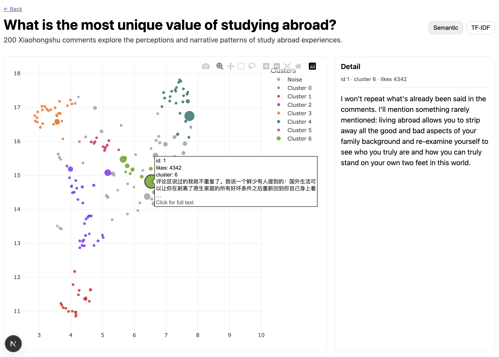

# Social Media Comment Map

**Social Media Comment Map** turns long-form social media comments into interactive 2D maps. Similar comments appear near one another, and clusters can be labeled with concise, LLM-generated themes. It supports two mapping methods:

- ✅ TF-IDF (local, fast)
- ✨ OpenAI embeddings (semantic, higher quality)

The output is a browsable web UI where you can switch between embeddings and click any point to read the full comment.



## 🧭 For Developers

This repo is organized into two parts:

- `scripts/` for embedding, dimensionality reduction (UMAP), and clustering (HDBSCAN)
- `web/` for the Next.js visualization UI

## 📄 Input Data Format

The pipeline expects each dataset to live under:

```
data/datasets/<dataset_id>/processed/
```

Your cleaned file should be named:

- `comments_cleaned.xlsx` or
- `comments_cleaned.csv`

Required column:

- `comment_text`

Optional columns (will be included in the map output if present):

- `user`
- `time_raw`
- `location_raw`
- `likes`

Example cleaned file:

- `data/examples/comments_cleaned.csv`

## 📦 Included Sample Datasets

This repo includes a couple of sample datasets under `data/datasets/` (the XHS examples) so the UI works out of the box. You can add your own datasets alongside them or remove them if you prefer a clean starting point.

## 🧾 Dataset Metadata

Each dataset also needs a metadata file:

- `data/datasets/<dataset_id>/processed/dataset.json`

Example:

```json
{
  "id": "example_demo",
  "platform": "example",
  "title": "Example Dataset (Synthetic)",
  "created_at": "2026-02-08",
  "description": "Synthetic comments to validate the pipeline"
}
```

## 🚀 Quick Start

1. Install Python dependencies:

```bash
pip install -r scripts/requirements.txt
```

2. Add a cleaned dataset:

```
data/datasets/<dataset_id>/processed/comments_cleaned.xlsx
```

And add metadata:

```
data/datasets/<dataset_id>/processed/dataset.json
```

3. Generate maps (TF-IDF and OpenAI):

```bash
python3 scripts/10_embed_umap_cluster.py --dataset <dataset_id> --mode tfidf
python3 scripts/10_embed_umap_cluster.py --dataset <dataset_id> --mode openai
```

For OpenAI embeddings, set `OPENAI_API_KEY` in your environment.

OpenAI embeddings are clustered in a higher-dimensional semantic projection;
TF-IDF clusters the visible lexical neighborhoods. TF-IDF requires at least five
clusters by default and stops before publishing a result below that boundary.
Use `--min_clusters` to change it.

Embeddings are cached and clustering diagnostics are saved automatically. To
compare HDBSCAN configurations and stability without recomputing embeddings:

```bash
python3 scripts/11_evaluate_cluster_candidates.py --dataset <dataset_id> --mode openai
python3 scripts/11_evaluate_cluster_candidates.py --dataset <dataset_id> --mode tfidf
```

4. Generate grounded cluster labels (optional but recommended):

```bash
python3 scripts/30_label_clusters.py --dataset <dataset_id> --mode openai
python3 scripts/30_label_clusters.py --dataset <dataset_id> --mode tfidf
```

The script drafts labels from representative comments, then contrastively checks
them across clusters. Labels are cached; use `--force` to regenerate them or
`--prepare_only` to inspect the evidence without making an LLM request. Set
`LABELING_MODEL`, pass `--model`, or add `cluster_overrides_<mode>.json` for
durable human edits.

5. Build the web dataset index:

```bash
python3 scripts/99_build_index.py
```

6. Run the web app:

```bash
cd web
npm install
npm run dev
```

## 📤 Outputs

Maps are written to:

- `data/datasets/<dataset_id>/processed/comments_map_tfidf.json`
- `data/datasets/<dataset_id>/processed/comments_map_openai.json`

Additional artifacts include:

- `cluster_metadata_<mode>.json`: verified labels and summaries used by the UI

Embedding caches, candidate reports, diagnostics, and labeling evidence are
generated locally but ignored by Git. Maps and cluster metadata are copied into
`web/public/datasets/<dataset_id>/` by `scripts/99_build_index.py`.

## 🧪 Example Demo (End-to-End)

This uses the included example file and should work for any new user.

1. Create a dataset folder and copy the example CSV:

```bash
mkdir -p data/datasets/example_demo/processed
cp data/examples/comments_cleaned.csv data/datasets/example_demo/processed/comments_cleaned.csv
```

2. Add metadata:

```bash
cat > data/datasets/example_demo/processed/dataset.json <<'EOF'
{
  "id": "example_demo",
  "platform": "example",
  "title": "Example Dataset (Synthetic)",
  "created_at": "2026-02-08",
  "description": "Synthetic comments to validate the pipeline"
}
EOF
```

3. Build the TF-IDF map:

```bash
python3 scripts/10_embed_umap_cluster.py --dataset example_demo --mode tfidf
```

4. (Optional) Build the OpenAI map:

```bash
export OPENAI_API_KEY=your_key_here
python3 scripts/10_embed_umap_cluster.py --dataset example_demo --mode openai
```

5. (Optional) Label the clusters:

```bash
python3 scripts/30_label_clusters.py --dataset example_demo --mode tfidf
python3 scripts/30_label_clusters.py --dataset example_demo --mode openai
```

6. Build the dataset index and run the UI:

```bash
python3 scripts/99_build_index.py
cd web
npm install
npm run dev
```

Then visit `http://localhost:3000` and open “Example Dataset (Synthetic)”.

## 🌐 GitHub Pages

Pushing a commit to `main` automatically builds and deploys the site through
GitHub Actions. Commit the generated files under `web/public/datasets/`; the
deployment workflow does not run the embedding or LLM-labeling scripts.

## 📜 License

See `LICENSE`.
